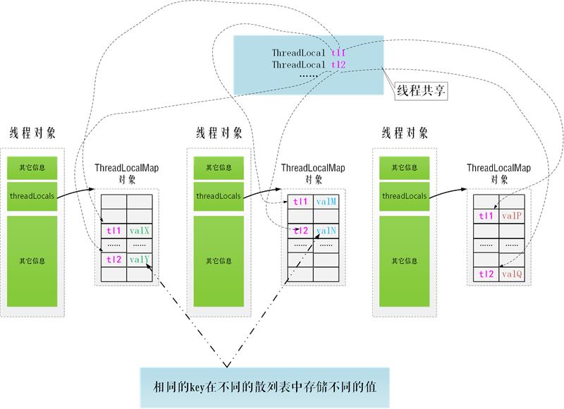
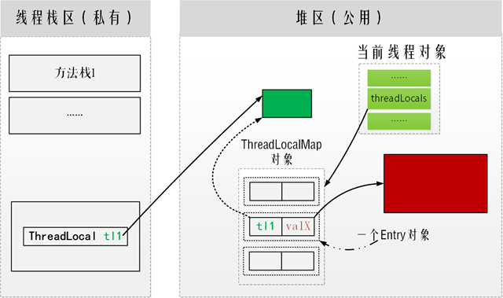

### 空闲线程
代码如下：
新建一个线程池，该线程池有5个核心线程，最大线程数是10，超时时间为1000毫秒。  

线程执行过程如下：
1. 对于1-5的任务，线程池会新建线程来执行任务；
1. 对于6-10的任务，线程池会将任务放入到任务队列中；
1. 对于11-15的任务，线程池会新建线程来执行任务；
1. 在线程执行完1-5的任务后，会从任务队列中取出6-10的任务来执行；
1. 若执行executor.allowCoreThreadTimeOut(true); 意为可以关闭除核心线程数之外的空闲线程，这种情况下剩余线程数为5；
1. 若执行executor.allowCoreThreadTimeOut(false); 意为保留除核心线程数之外的空闲线程，这种情况下剩余线程数为10；
```java
public class IdleThreadTest {
    public static void main(String[] args) {

        ThreadPoolExecutor executor = new ThreadPoolExecutor(5, 10, 1000, TimeUnit.MILLISECONDS,
                new ArrayBlockingQueue<Runnable>(5), new ThreadPoolExecutor.CallerRunsPolicy());
        executor.allowCoreThreadTimeOut(true);
        System.out.println("核心线程空闲超时是否关闭:" + executor.allowsCoreThreadTimeOut() + "\n");//核心线程空闲超时是否关闭:false
        for (int i = 1; i <= 15; i++) {
            MyTask myTask = new MyTask(i);
            executor.execute(myTask);
            System.err.println("线程池中线程数目：" + executor.getPoolSize() + "，队列中等待执行的任务数目：" +
                    executor.getQueue().size() + "，已执行完的任务数目：" + executor.getCompletedTaskCount() + "，执行任务：" + i);
        }

        try {
            Thread.sleep(5000);
        } catch (InterruptedException e) {
            e.printStackTrace();
        }

        System.err.println();
        System.err.println("线程池中线程数目：" + executor.getPoolSize() + "，队列中等待执行的任务数目：" +
                executor.getQueue().size() + "，已执行完的任务数目：" + executor.getCompletedTaskCount());
    }
}

class MyTask implements Runnable {
    private int taskNum;

    public MyTask(int num) {
        this.taskNum = num;
    }

    @Override
    public void run() {
        System.out.println("线程名称：" + Thread.currentThread().getName() + "，正在执行 task " + taskNum);
        try {
            Thread.currentThread().sleep(1000);
        } catch (InterruptedException e) {
            e.printStackTrace();
        }
        System.err.println("[线程名称：" + Thread.currentThread().getName() + "，执行完毕 task " + taskNum + "]");
    }
}
```
运行结果如下：
```java
核心线程空闲超时是否关闭:true
线程池中线程数目：1，队列中等待执行的任务数目：0，已执行完的任务数目：0，执行任务：1

线程名称：pool-1-thread-1，正在执行 task 1
线程名称：pool-1-thread-2，正在执行 task 2
线程名称：pool-1-thread-3，正在执行 task 3
线程池中线程数目：2，队列中等待执行的任务数目：0，已执行完的任务数目：0，执行任务：2
线程名称：pool-1-thread-4，正在执行 task 4
线程名称：pool-1-thread-5，正在执行 task 5
线程池中线程数目：3，队列中等待执行的任务数目：0，已执行完的任务数目：0，执行任务：3
线程名称：pool-1-thread-6，正在执行 task 11
线程池中线程数目：4，队列中等待执行的任务数目：0，已执行完的任务数目：0，执行任务：4
线程名称：pool-1-thread-7，正在执行 task 12
线程池中线程数目：5，队列中等待执行的任务数目：0，已执行完的任务数目：0，执行任务：5
线程名称：pool-1-thread-8，正在执行 task 13
线程池中线程数目：5，队列中等待执行的任务数目：1，已执行完的任务数目：0，执行任务：6
线程名称：pool-1-thread-9，正在执行 task 14
线程池中线程数目：5，队列中等待执行的任务数目：2，已执行完的任务数目：0，执行任务：7
线程名称：pool-1-thread-10，正在执行 task 15
线程池中线程数目：5，队列中等待执行的任务数目：3，已执行完的任务数目：0，执行任务：8
线程池中线程数目：5，队列中等待执行的任务数目：4，已执行完的任务数目：0，执行任务：9
线程池中线程数目：5，队列中等待执行的任务数目：5，已执行完的任务数目：0，执行任务：10
线程池中线程数目：6，队列中等待执行的任务数目：5，已执行完的任务数目：0，执行任务：11
线程池中线程数目：7，队列中等待执行的任务数目：5，已执行完的任务数目：0，执行任务：12
线程池中线程数目：8，队列中等待执行的任务数目：5，已执行完的任务数目：0，执行任务：13
线程池中线程数目：9，队列中等待执行的任务数目：5，已执行完的任务数目：0，执行任务：14
线程池中线程数目：10，队列中等待执行的任务数目：5，已执行完的任务数目：0，执行任务：15
线程名称：pool-1-thread-3，正在执行 task 6
[线程名称：pool-1-thread-3，执行完毕 task 3]
线程名称：pool-1-thread-5，正在执行 task 7
[线程名称：pool-1-thread-5，执行完毕 task 5]
线程名称：pool-1-thread-4，正在执行 task 9
[线程名称：pool-1-thread-1，执行完毕 task 1]
线程名称：pool-1-thread-1，正在执行 task 8
[线程名称：pool-1-thread-4，执行完毕 task 4]
线程名称：pool-1-thread-2，正在执行 task 10
[线程名称：pool-1-thread-2，执行完毕 task 2]
[线程名称：pool-1-thread-7，执行完毕 task 12]
[线程名称：pool-1-thread-9，执行完毕 task 14]
[线程名称：pool-1-thread-6，执行完毕 task 11]
[线程名称：pool-1-thread-10，执行完毕 task 15]
[线程名称：pool-1-thread-8，执行完毕 task 13]
[线程名称：pool-1-thread-2，执行完毕 task 10]
[线程名称：pool-1-thread-1，执行完毕 task 8]
[线程名称：pool-1-thread-5，执行完毕 task 7]
[线程名称：pool-1-thread-4，执行完毕 task 9]
[线程名称：pool-1-thread-3，执行完毕 task 6]

// executor.allowCoreThreadTimeOut(true);
线程池中线程数目：0，队列中等待执行的任务数目：0，已执行完的任务数目：15

// executor.allowCoreThreadTimeOut(false);
线程池中线程数目：5，队列中等待执行的任务数目：0，已执行完的任务数目：15
```
若将任务数增至50，那么会出现如下结果：

这是因为使用了new ThreadPoolExecutor.CallerRunsPolicy()拒绝策略，会使主线程（main）来执行任务，可以看到线程池只执行了46个任务。
```java
线程名称：main，正在执行 task 49
[线程名称：main，执行完毕 task 49]

线程池中线程数目：5，队列中等待执行的任务数目：0，已执行完的任务数目：46
```
### ThreadLocal  
- 在线程池中，当线程退出之前一定要记得调用ThreadLocal的remove()方法，因为在线程池中的线程对象是循环使用的，也为了解决内存泄露的问题，这在线程池操作中是必须的。
- 一个Entry对象中存储了ThreadLocal对象的弱引用和这个ThreadLocal对应的value对象的强引用。
- 调用get()、set()或remove()方法时，会尝试删除key为null的Entry，以释放value对象所占用的内存。但并不能完全解决内存泄露问题，因为我们在这个方法结束的时候逻辑上不一定必须调用get方法，而get方法也不一定执行getEntryAfterMiss方法。所以类本身是没有这个能力的。  

在下面的例子中，新建了有2个线程的线程池，使用Semaphore来同步，使之顺序执行。
1. 自定义Runnable在结束run()方法时手动调用了remove()方法，所以线程复用时不会访问到以前的值；
1. 若没有对ThreadLocal调用remove()方法，会导致第3个任务复用了第1个线程，也就访问到了其中ThreadLocal中的变量。
```java
// 类变量
Semaphore semaphore = new Semaphore(1);

// main()中
ExecutorService es = Executors.newFixedThreadPool(2);
es.execute(tld.new Worker());
es.execute(tld.new Worker());
es.execute(tld.new Worker());

// run()中
try {
    Thread.sleep(rnd.nextInt(1000)); /*随机延时1s以内的时间*/
    semaphore.acquire();/*获取许可*/
} catch (InterruptedException e) {
    e.printStackTrace();
}

int valA = tlA.get();
System.out.println(Thread.currentThread().getName() + " tlA initial val : " + valA);
valA = rnd.nextInt();
tlA.set(valA);
System.out.println(Thread.currentThread().getName() + " tlA  new     val: " + valA);

semaphore.release();

tlA.remove();
pool-1-thread-2 tlA initial val : 3
pool-1-thread-2 tlA  new     val: 934446743
pool-1-thread-2 tlA initial val : 3
pool-1-thread-2 tlA  new     val: -1980335439
pool-1-thread-1 tlA initial val : 3
pool-1-thread-1 tlA  new     val: 407747559

//tlA.remove();
pool-1-thread-1 tlA initial val : 3
pool-1-thread-1 tlA  new     val: 1978392419
pool-1-thread-2 tlA initial val : 3
pool-1-thread-2 tlA  new     val: 1570051260
pool-1-thread-1 tlA initial val : 1978392419
pool-1-thread-1 tlA  new     val: 766111886
```





[谁问你ThreadLocal，就把这篇文章丢给他](https://mp.weixin.qq.com/s?__biz=MzI2OTQ4OTQ1NQ==&mid=2247484981&idx=1&sn=6740c45ea988ccd1171ffba2e854eaed&chksm=eadec275dda94b63cf97fc5233a9fce319ac5e79b34728134a36dbc7265b9a2a81b41c9e826a&mpshare=1&scene=1&srcid=0830TtuehBnlxQeATXcu0DAT#rd)  
[ThreadLocal原理及使用示例](https://www.cnblogs.com/nullzx/p/7553538.html)  
